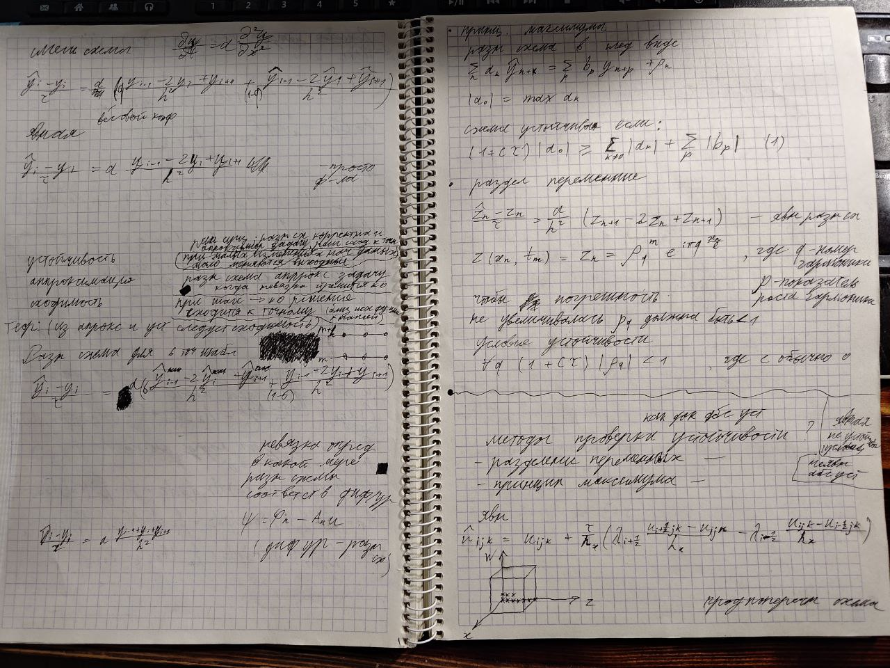

## Финальная лр
На последней лабораторной каждому студенту было необходимо индивидуально защититься.

**Лучше всего брать 2-е решение**, оно логичнее и понятнее всего написано

### Пул вопросов
Каким методом делали? 
- локально одномерным
  
Покажите шаги 
- (по записям)

Какую схему использовали?
- полностью не явную

А какие ещё бывают?
- явная и смешанная

Запишите вашу разностную схему в явном виде
- вот тоже самое только без крышек (про разностную схему)
  
Хорошо, а как вычислять по явной схеме?
- у нас формула с одним неизвестным, по которой мы и вычисляем

А почему использовали именно неявную схему?
- потому что неявная абсолютно устойчива, а явная условно устойчивая

А что у нас вообще есть, какие три характеристики?
- устойчивость - при малых изменениях начальных данных, мало меняются выходные; 
- аппроксимация - разностная схема аппроксимирует задачу, когда невязка стремится к 0 (невязка определяет в какой мере разностная схема соответствует диф уравнению эта = фи - Au(диф ур минус разностная схема));
- сходимость - при шаге стремящемся к 0 решение сходится к точному

Расскажите теорему сходимости
- существует единственное решение, если разностная схема корректна(здесь, наверное, он подразумевал устойчива) и аппроксимирует задачу, решение сходится к точному (или короткая версия: из аппроксимации и устойчивости следует сходимость)

Так а какие существуют методы проверки устойчивости?
- принцип максимума и разделение переменных

Что такое принцип максимума?
- на фотке, словами это ему никто не описывал

Что такое разделение переменных, какой критерий?
- критерий - модуль показателя роста гармоники должен быть меньше 1
  
Хорошо, вот вам простейшее уравнение напишите для него смешанную и явную схемы(а что такое q (сигма с лекции)) 
- на фотке и весовой коэффициент

Напишите для 6-ти точечного шаблона
- тоже самое что и смешанная

А сколько понадобится итераций (или прогонок уже не уверен, скорее прогонок) если у нас 100 на 100?
- 3 * 100 * 100 (три шага же)

### UPD:
Как работает итерация? 
- ps не знаю

Вот мы вводим фиктивное время, но у нас же в исходном уравнении 0, как мы решаем эту проблему?
- мы итерируемся и постепенно приращение времени(du/dt) сходится к 0, тогда это финальное и наше уравнение становятся стационарным

Сколько ядер в вашей видеокарте?
- см характеристики своей, там примерно от 400 до 16000 скорее всего

